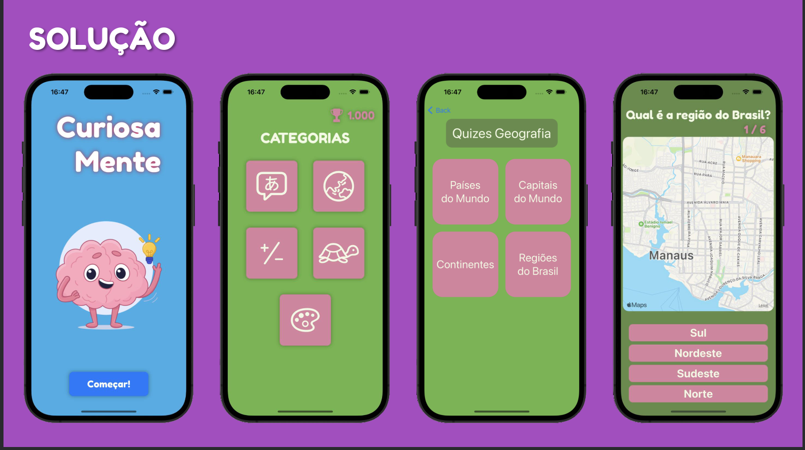
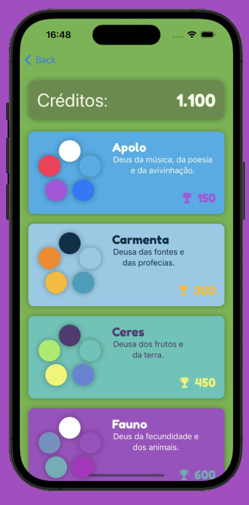

# Curiosamente

This repository contains a Swift application developed in Hackatruck MakerSpace, the app performs quizzes on different topics in a gamified way and is focused on the children's audience, to encourage studying in a more fun way.

## Features

- **Geography Quiz:** Test your knowledge of world geography with a wide range of questions covering continents, countries, capitals, landmarks, and more.
- **Math Quiz:** Challenge yourself with various math problems, including arithmetic, algebra, geometry, and logic puzzles.
- **Text Quiz:** Enhance your language skills by answering questions related to grammar, vocabulary, comprehension, and literary devices.
- **Theme Changer:** Change your theme based on the amount of points you got doing quizzes, gamefying the app and giving the user a incentive to play more and earn rewards.
## Screenshots

## Thanks to my team

- André de Oliveira Brandão
- David Dias Pinto
- Pedro Malta Boscatti
- Samuel Marques Souza Leal
